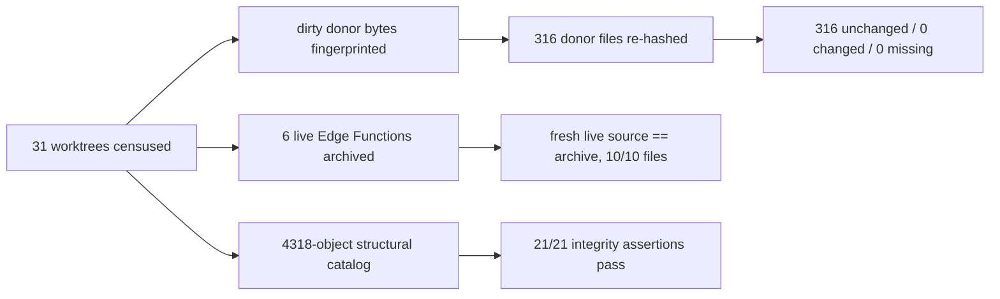

# Phase A evidence reconciliation — 2026-10-03

**PHASE A = READY FOR READ-ONLY PHASE B.** Phase C (Senshial / agent write execution) is **BLOCKED**. No provider, execution path or credential was implemented in this continuation.

This continuation resumes the interrupted Phase A finalization in the existing convergence worktree. It verified the partially generated evidence, corrected two stale claims, made the reconciliation reproducible and asserted, and recorded current exact-head CI.

| Baseline | Value |
|---|---|
| origin/main | `ae7c0d394ea07047f3c0ef534411872a59c2711f` |
| Branch | `codex/reality-convergence-ai-runtime` |
| Observed PR head | `b25b3b727662df65549d0244d0ddf85c797f03f2` |
| PR | [#31](https://github.com/daynightae-cmyk/knoux-store/pull/31), OPEN, DRAFT, MERGEABLE, not merged |
| Dependency owner | PR #30, OPEN at `a1e092828d3b2528e13b70ab9c20cabf8fa7d2dd` |

No application, runtime, CI, migration, permission or donor path was changed. No live request was submitted to any deployed function. No secret literal was read, reconstructed or written.

## What was wrong at handoff, and what was done

| Finding at handoff | Evidence | Resolution |
|---|---|---|
| The merge of masked staging-policy metadata into the live catalog may not have completed | Both `signal_overture_temp_*` policies absent from the catalog's classification set recorded in the draft report | The merge had completed: both policies are present, masked and classified SECRET-DEPENDENT |
| The report's catalog table was stale | Report claimed SECRET-DEPENDENT 159 / UNKNOWN 3,856; catalog holds 161 / 3,854 | Report corrected against the catalog actually on disk |
| The report claimed the browser job was still running | Job 111108178942 is terminal | Recorded as PASS; the CI section below is now a terminal result, not an expectation |
| `application-catalog-summary.json` carried a `snapshotSha256` over the pre-merge 4,316-object catalog that could not be reproduced from any surviving artifact | No derivation reproduced the value | Replaced with `catalogObjectsSha256`, computed over the catalog on disk by a documented derivation, with per-object claims re-asserted |
| `foursquare-reference-scan.json` recorded a SHA-256 of a catalog file that reconciliation has since rewritten | Recorded hash did not match the file on disk | Rescanned; conclusion unchanged |
| **The evidence generator's Git blob reader was unsound** | `git show <ref>:<path>` for `src/app/api/build/bridge/control/jobs/[id]/route.ts` — a path **absent** from the pinned base — returned a **commit object** instead of failing, so the component carried a non-null `mainSha256` equal to a commit hash and a fabricated source comparison. The value also shifted whenever HEAD moved | Replaced with a strict `cat-file -t` type check; absent paths are now `null`, that component's comparison is `UNKNOWN`, and two new assertions pin every recorded hash to the base tree |
| No component-level classification answered "which executable artifact does the running Bridge path load?" | Absent | Every one of 64 components now carries `canonicalExecutionRole`, and all 64 are UNVERIFIED |
| The reconciliation was a generator with no integrity gate | `reconcile-phase-a.mjs` wrote files and exited 0 unconditionally | Added a 21-assertion read-only gate that fails loudly |

## VERIFIED — archive and structural evidence



| Check | Result |
|---|---|
| Worktrees inventoried | 31 |
| Donor files re-hashed outside PR #30 ownership | 316 checked, 316 unchanged, 0 changed, 0 missing |
| Deployed Edge Function aliases | 6 |
| Edge Function source files: fresh live vs archived deployed | 10 / 10 identical, versions and bundle fingerprints identical |
| Structural catalog objects | 4,318 across public, auth, storage, realtime, extensions, pgsodium, vault, supabase_migrations |
| Public application tables | 39 public relations = 32 tables + 7 sequences; all 32 tables RLS enabled, none forced |
| Public RPC signatures | 36 |
| Installed extensions | 7 |
| Applied migration statements recovered | 22 of 39, each MD5-verified |
| Applied migration statements withheld | 17, statement text absent, MD5 fingerprint retained |
| Archived donor files | 35, all still byte-identical on disk |
| Application tests / bridge tests / focused browser checks (unchanged app) | 433 / 167 / 15 |
| Integrity assertions | 21 passed, 0 failed |

### Catalog comparison against exact origin/main

| Comparison class | Objects |
|---|---:|
| MATCHES SOURCE | 128 |
| LIVE ONLY | 175 |
| DIVERGED | 0 affirmative differences proved by this limited matcher |
| SECRET-DEPENDENT | 161 |
| UNKNOWN | 3,854 |
| SOURCE ONLY (additional declarations) | 46 |

The 128 matches are column type, nullability, default and identity comparisons after whitespace and type-alias normalization. Twelve Signal routine bodies and their security modes compare equal; complete signature, configuration and grant closure is still unproved.

**Zero affirmative DIVERGED entries is not schema parity.** 3,854 objects are UNKNOWN, including all managed namespace objects, all implicit or generated indexes, all policy bodies beyond the two masked staging policies, and every constraint closure. The matcher is a conservative declaration reader, not a PostgreSQL parser and not a replay-derived final schema.

Main lacks `CREATE TABLE` declarations for the live foundation and live `knoux_bridge_*` control-plane tables. Four tables declared in main's `20261001093000_knoux_build_bridge.sql` are absent live: `knoux_build_bridges`, `knoux_build_approvals`, `knoux_build_audit`, `knoux_build_runs`. That is a recorded gap, not a recommendation to apply the migration.

All 32 public tables have RLS **enabled**. RLS enabled is not RLS authorization correct, and no policy body was semantically reviewed for sufficiency.

## UNVERIFIED — canonical Bridge implementation

[Reconciliation](evidence/2026-10-03/bridge-reconciliation.json) compares 64 components with exact hashes for main blobs, dirty donor bytes, recovery-source bytes, archived deployed source and fresh deployed source. Missing evidence is recorded as null, never inferred.

| Component class | Count | Meaning |
|---|---:|---|
| `canonicalExecutionRole = VERIFIED CANONICAL` | **0** | No component is proven to be what the running Bridge path loads |
| `canonicalExecutionRole = UNVERIFIED` | 64 | Deployment or process attestation absent for every component |
| source `classification = MATCH` | 7 | Scoped to compared sources only |
| source `classification = DIVERGED` | 3 | knoux-bridge-control index.ts and deno.json, knoux-store-mcp-gateway index.ts — archive matches fresh live source, dirty donor differs, chronology unproved |
| source `classification = UNKNOWN` | 54 | Includes every non-edge component |

**The key unresolved requirement is not source archive recovery. It is proving which executable implementation is canonical for the running Bridge path.** Source equality does not prove runtime identity, and the reconciliation refuses to infer it from a hash match. The old local-control-plane archive identifies source commit `b7f7c127b6338661f0f6f2ae8b8eb00809e18431` — that is source provenance, not deployment provenance.

## UNVERIFIED — six-alias callers and auth

[Caller map](evidence/2026-10-03/edge-caller-map.json) records every alias's repository, donor and live-source call sites, expected caller, expected authentication and observed activity.

| Alias / version | Expected code-level auth | Activity at current version | Caller identity |
|---|---|---|---|
| knoux-bridge-control / 9 | Signed enrolled registration; expiring hashed session bearer; scoped gateway bearer | 200×2, 400×1, 401×1 | UNVERIFIED |
| knoux-store-mcp-gateway / 2 | External MCP bearer forwarded through control gateway endpoints | 200×36, 202×3 | UNVERIFIED |
| knoux-bridge-gateway-api / 1 | Active unexpired hashed `x-knoux-gateway-token` | 200×5 | UNVERIFIED |
| knoux-bridge-control-smoke / 1 | None; public constant-response diagnostic | no entries in window | UNVERIFIED |
| knoux-store-bridge-control / 2 | Signed enrolled machine; session bearer; Google gateway ID token with issuer, expiry, audience, email checks | 200×278, 204×763, 401×3 | UNVERIFIED |
| knoux-store-mcp / 1 | External MCP scoped active unexpired hashed bearer | 200×10 | UNVERIFIED |

Activity window is 2026-10-02 03:00 to 2026-10-03 02:59 UTC; older versions are recorded separately. No credential or request content was selected. **Expected code-level auth is not observed caller identity.** HTTP 200 does not identify a subject. Five of six aliases carry traffic at their current version, so none can be classified retired; only `knoux-bridge-control-smoke` is idle in the window, and zero logs is not proof of disuse. Two parallel live implementation pairs exist — `knoux-bridge-control` alongside `knoux-store-bridge-control`, and `knoux-store-mcp-gateway` alongside `knoux-store-mcp` — and both members of each pair are active. Main runtime source contains no direct alias call site. No alias was changed.

## WITHHELD and BLOCKED — temporary staging surfaces

Two Overture staging policies are recorded in [withheld-policy-structure.json](evidence/2026-10-03/withheld-policy-structure.json) as identity, policy role, command, structural shape, MD5 fingerprint, `[WITHHELD LITERAL]` markers and a SECRET-DEPENDENT classification. No secret literal exists in any evidence file; the secret scanner reports zero credential-class values across all 24 artifacts and across every decoded archived donor source.

The scanner reviewed eight quoted literals surviving inside secret-dependent definitions and classified them as vault secret **names**, schema names, scope names and exception message text — not credential values, not key material.

[Review](evidence/2026-10-03/foursquare-staging-review.json): `public.signal_temp_stage_foursquare(p_token text, p_rows jsonb)` is postgres-owned SECURITY DEFINER, executable by anon, authenticated and service_role, with no PUBLIC grant. It checks one shared embedded token, requires an array, caps calls at 1,500, filters a fixed dataset and upserts only `signal_source_records_staging`. It does not itself promote business records. No `auth.uid`, token expiry, replay or rate control is visible in its body.

The rescan examined over 21,000 files across every registered worktree plus restored and integration roots, skipping `node_modules`, `.git`, `.next`, build output, data, virtualenvs, `.env*` and files over 4 MB. Every match is an audit artifact — the reference exists in this repository's own evidence and in the scan tooling, and nowhere else. **That is not proof of an unused RPC** — external jobs, clients and schedulers are outside these roots, and `track_functions=none` makes zero recorded calls unusable as inactivity evidence.

OWNER = UNVERIFIED. CONTINUED NEED = UNVERIFIED. RETIREMENT = BLOCKED. No permission was revoked, no RPC dropped, no token touched.

## ARCHIVED — semantic donor decisions

[Semantic review](evidence/2026-10-03/donor-semantic-review.json) covers every changed file in both one-commit donors with exact donor and main hashes. The assertion gate independently re-derives the candidate set from `git diff-tree` and requires an exact set match, so coverage cannot silently drift.

| Donor | Candidates | PORT | SUPERSEDED | REFERENCE ONLY | BLOCKED | UNKNOWN |
|---|---:|---:|---:|---:|---:|---:|
| PR #6 `ff90282` | 38 | 0 | 29 | 6 | 3 | 0 |
| Signal `848c0eb` | 20 | 0 | 4 | 4 | 12 | 0 |
| **Total** | **58** | **0** | **33** | **10** | **15** | **0** |

No candidate has sufficient evidence for direct runtime port. No acquisition, ingest, Python import, SQL replay or wholesale merge occurred; every candidate is recorded `executed: false`, asserted by the gate.

The earlier heuristic suggesting `consolidate_manifests.py` promotes database records is withdrawn: no such call was found; it writes a local manifest of historical claims.

## VERIFIED and OPEN — dependencies

| Audit | Result |
|---|---|
| [Production](evidence/2026-10-03/production-audit.json) | 0 advisories, exit 0 — **VERIFIED** |
| [Full dev/tooling](evidence/2026-10-03/full-tooling-audit.json) | 6 high graph findings, exit 1 — **OPEN TOOLING RISK** |

One underlying [braces advisory](https://github.com/advisories/GHSA-vfj7-8cjw-p6xm) (`braces <=3.0.3`, patched versions: None) yields six affected graph nodes: `braces`, `micromatch`, `fast-glob`, `knip`, `@next/eslint-plugin-next`, `eslint-config-next`. npm proposes breaking `knip` 6.39.0 and `eslint-config-next` 14.2.35 graph changes; no compatible full-graph resolution was validated or applied.

PR #30 owns remediation. Making the production audit blocking is **not** a fix for the tooling graph. Until an upstream-compatible resolution is proven, this remains an open tooling risk owned by PR #30. No dependency or CI file was changed here.

## VERIFIED — exact-head CI

Observed for PR #31 at head `b25b3b727662df65549d0244d0ddf85c797f03f2`, [run 37090019287](https://github.com/daynightae-cmyk/knoux-store/actions/runs/37090019287):

| Check | Result |
|---|---|
| CodeQL | **PASS** |
| CodeQL static analysis | **PASS** |
| Routes, responsive geometry and automated accessibility | **PASS** (job 111108178942, 36m36s, terminal) |
| Lint, types, build, tests, coverage, audit | **FAIL** (job 111108178961) |
| Vercel | **PASS** |
| CodeRabbit | skipped — draft pull request |
| Gitar | PASS |

The failing job's step detail, which matters more than the job name:

| Step | Conclusion |
|---|---|
| npm ci | success |
| Lint | success |
| Typecheck | success |
| Production build | success |
| Unit and integration tests | success |
| Coverage | success |
| **Dependency audit** | **failure** — `6 high severity vulnerabilities`, exit 1 |
| Dead code and dependency graph | skipped — never ran, because the audit step failed first |

So lint, types, build, tests and coverage genuinely pass at this exact head. The only failing step is the dependency audit, and the knip dead-code step never executed. No test suite was re-run locally; nothing in application code changed.

## PHASE A GATES

Each gate is classified separately. The distinction that matters: historical archaeology is not a runtime safety dependency and must not hold Phase B hostage; write-path canonicality is.

| # | Gate | State | Why |
|---|---|---|---|
| 1 | Exact main SHA/tree and implementation base | **VERIFIED** | `ae7c0d3` / `822c50e`; every comparison artifact re-pins that SHA |
| 2 | Dirty donors and unique visual/reference preservation | **VERIFIED** | 316/316 fingerprints unchanged; 35 archived donor files byte-identical |
| 3 | Six deployed Edge Function sources recoverable in canonical Git | **VERIFIED** | 10/10 fresh live files equal the archived deployed source |
| 4 | Six deployed aliases covered by caller/auth evidence | **VERIFIED** | live, archived and caller sets asserted equal, 6/6 |
| 5 | PR #6 unique-value semantic review | **VERIFIED** | 38/38 classified, set asserted against `git diff-tree` |
| 6 | Signal unique-value semantic review | **VERIFIED** | 20/20 classified, set asserted against `git diff-tree` |
| 7 | Evidence integrity and secret safety | **VERIFIED** | 21/21 assertions; 0 credential-class values; reconciliation idempotent |
| 8 | Current main application baseline stable | **VERIFIED** | lint, types, build, tests, coverage all pass at the exact head |
| 9 | Production dependency audit | **VERIFIED** | 0 advisories |
| 10 | Evidence tooling reproducible | **VERIFIED** | generator byte-stable across repeated runs; recheck and scan re-runnable |
| 11 | Full schema / source / migration parity | **HISTORICAL PROVENANCE GAP ONLY** | 3,854 UNKNOWN, 175 LIVE ONLY, 46 SOURCE ONLY, 17 withheld statements stay withheld. Not reconstructed, not required for read-only provider work |
| 12 | Temporary staging RPC closure | **SECURITY FOLLOW-UP** | Foursquare RPC and two staging policies remain open; documented, masked, unmutated |
| 13 | Full dev/tooling dependency gate | **SECURITY FOLLOW-UP** | 6 high graph findings, owned by PR #30 |
| 14 | Exact-head CI verify job | **SECURITY FOLLOW-UP** | Red solely on the dependency audit step; all other steps pass |
| 15 | Canonical executable implementation of the running Bridge path | **UNVERIFIED — BLOCKS WRITE** | 0/64 components attested; parallel live implementations; no deployment attestation |
| 16 | Actual caller identity and ownership for six aliases | **UNVERIFIED — BLOCKS WRITE** | Code-level expected auth documented; observed subject, configuration and ownership unproved |

## PHASE DECISION

**PHASE A READY FOR READ-ONLY PHASE B.**

Read-only Phase B may begin: server-side provider execution that reads configuration and returns results, implemented without depending on any unresolved Bridge mutation path, holding credentials server-side, built on the stable current main baseline, with gates 11–14 documented as open follow-ups rather than silently dropped.

The conditions the decision depends on, each verified above:

- Provider execution can be implemented server-side without relying on unresolved Bridge mutation paths — gates 15 and 16 are unresolved only for **write** paths; nothing in read-only provider execution consumes them.
- Secrets remain safe — zero credential-class values in evidence, all secret-dependent expressions masked, no credential read or written.
- The current main/application baseline is stable — lint, types, build, tests and coverage pass at the exact observed head.
- Unresolved issues are explicitly documented — gates 11 through 16 above, with owners.

This state was not invented to move faster. Gates 1 through 10 are verified, and the four historical/security items were separated from the two write-capability items on the basis of whether they are a runtime safety dependency for read-only provider work. They are not.

**Not claimed: PHASE A READY TO BEGIN FULL PHASE B.**

## AGENT WRITE READINESS

**BLOCKED.**

Exact blockers, any one of which is sufficient:

1. **Canonical Bridge implementation unproven.** 0 of 64 components are attested as the artifact the running path loads. Five of six aliases carry traffic at their current version, across two pairs of parallel live implementations. An agent granted mutation capability would act on a write path whose executing code is not identified.
2. **Authorization unproven on that path.** The write path's actual caller identity, ownership and configuration are UNVERIFIED for all six aliases. Code-level expected auth exists; observed authorization does not.
3. **A privileged public staging mutation surface is open.** `signal_temp_stage_foursquare` is SECURITY DEFINER, anon-executable and gated by one shared embedded token with no visible expiry, replay or rate control. An agent able to write would share a surface where a learned token permits repeated privileged staging mutation.

Additional standing constraints: the Foursquare RPC must not be revoked or dropped on the strength of a repository scan; the two staging policy expressions must stay masked; and the 17 withheld historical statements must stay withheld.

## PRESERVATION PROOF

`recheck-preservation.mjs` re-hashes every file recorded dirty in `census.json`, excluding the PR #30 dependency-audit worktree:

```
checked 316 · unchanged 316 · changed 0 · missing 0
```

`verify-recovery.mjs` independently confirms 35 archived donor files still match their recorded SHA-256 **and** still match the bytes on disk in the donor worktree, plus 10 edge function files and 22 MD5-verified migration statements.

No donor was altered. `bridgeDirtyStatus` in the recheck artifact records the donor's dirty file list as an observation, not a modification.

## TOOLING

| Script | Purpose | Writes |
|---|---|---|
| `verify-recovery.mjs` | Archive integrity: donor bytes, edge source, migration MD5s | nothing |
| `reconcile-phase-a.mjs` | Idempotent generator: catalog classification, bridge reconciliation, donor review, dependency summary, summary rebinding | 4 evidence JSON files |
| `recheck-preservation.mjs` | Donor fingerprint recheck against the census | `preservation-recheck.json` |
| `rescan-foursquare-references.mjs` | Read-only RPC reference rescan | `foursquare-reference-scan.json` |
| `scan-secrets.mjs` | Credential scan, reports class and count only, never values | nothing |
| `assert-phase-a-evidence.mjs` | 21-assertion integrity gate | nothing |

Run order: `verify-recovery.mjs` → `reconcile-phase-a.mjs` → `recheck-preservation.mjs` → `rescan-foursquare-references.mjs` → `scan-secrets.mjs` → `assert-phase-a-evidence.mjs`.